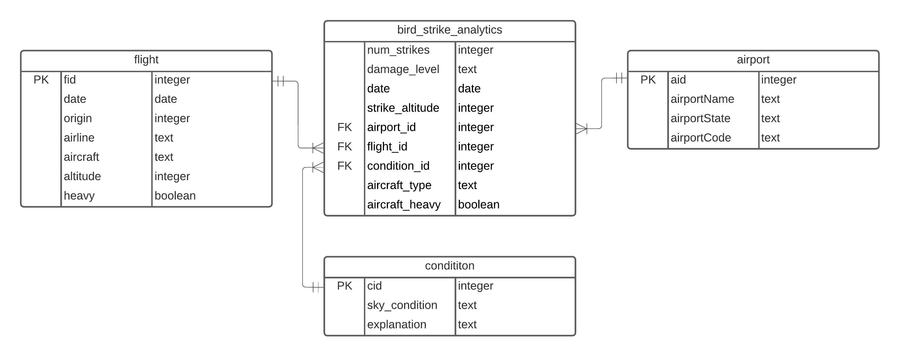

## Question 1

As data warehouses store large amounts of structured data it is often a case that they are composed of relational databases. They leverage specific structures and schemas to efficiently organize and analyze large amounts of data. Two key concepts in this context are fact tables and star schemas.

#### Fact Tables in Data Warehousing:
A fact table is a central table in a data warehouse schema. It contains the quantitative data for analysis and is usually the table with the most detailed information. Think of it as a table in a relational database filled with the actual measurements or metrics that a business cares about. Fact tables store different types of measurements, metrics, or facts of a business process. For example, in a retail business, the fact table might store data about sales transactions, like the number of items sold, sales amount, etc. Fact tables typically contain foreign keys that correspond to primary keys in the dimension tables. These foreign keys act as a point of connection to connect with related data in other tables. The level of detail in a fact table is known as granularity. It can range from very granular data (like individual transactions) to more summarized data (like monthly sales totals).

#### Star Schema in Data Warehousing:

The star schema is a simple database design that consists of one or more fact tables referencing any number of dimension tables. It is a simple way to organize a database. Imagine a star shape, where the center of the star is a big, main table (called a fact table), and the points of the star are smaller tables (called dimension tables) that spread out from the center.

It has the following advantages: 

   - It's easy to understand and navigate. 
   
   - Queries often perform better due to the simplified structure.
   
   - It's suitable for handling simpler queries, which are typical in data warehousing scenarios.

A little on **Dimension Tables** (they are an essential part of star schemas) - they are used to store attributes or fields that describe the business entities. For example, a product dimension table would include details about products.

Fact tables and star schemas are integral to constructing a data warehouse in a relational database environment, providing a structured and efficient way to analyze large sets of data.

#### OLAP in a Transactional Database?

**OLAP** is used for complex queries and analyses of data, typically in a data warehouse whereas transactional databases (**OLTP** systems) are optimized for CRUD (Create, Read, Update, Delete) operations, not for complex queries and analysis and as a result are **not ideal** for OLAP. Using a transactional database for OLAP can lead to performance degradation in transaction processing.

## Question 2

Data warehouses, data marts, and data lakes are all storage architectures used in managing big data, but they differ in terms of functionality, purpose, and the kind of data they store.

### Data Warehouse

By definition - a data warehouse is a large, centralized database specifically designed for query and analysis. It gathers data from various sources, such as transactional databases, and organizes it to support reporting and analysis which in turn helps businesses understand trends, see patterns, and make predictions based on the data they have collected over time. 

It has the following characteristics:

 - Primarily stores structured data from transactional systems, operational databases, and line of business applications.
 
 - Organized around key subjects such as customer, product, sales (i.e., it is subject-oriented).
 
 - Data is stored in a way to allow comparisons across different time periods (i.e., it can be used to analyze historical data).

An example use-case:

  - A healthcare system with many hospitals and clinics can use a data warehouse to keep track of a lot of different medical information. This includes patients' health records, registration details, lab test results, and billing information. In the data warehouse, this information is organized into different categories like patient histories, treatments, lab results, and staff work schedules. By looking at this data, doctors and hospital managers can understand common health issues, how well treatments are working, and how busy the hospitals are. This helps them improve how they care for patients, manage the hospitals better, and make smart choices about things like hiring staff and planning budgets.

### Data Mart

By definition - a data mart is a subset of a data warehouse, oriented to a specific line of business or team, like sales, finance, or marketing. Think of it like a mini data warehouse. It focuses on a particular subject or area – like sales, finance, or human resources – and contains only the data that's relevant to that area. This makes it easier and faster for the people in that department to find and use the information they need for their work, without having to sift through lots of unrelated data.

It has the following characteristics:

   - Data marts contains data relevant to a particular aspect of the business or department.
   
   - As they are smaller and more focused, data marts can be faster in terms of analysis and reporting of data.

An example use-case:

  - Continuing with our healthcare system example - a good example of a data mart could be one specifically designed for the cardiology department. This cardiology data mart would pull relevant information from the larger data warehouse, focusing solely on data related to heart-related treatments and patient care.

### Data Lake

By definition - a data lake is a large storage repository that holds a vast amount of raw data in its native format until it is needed. Unlike a data warehouse, which stores data in a structured format, a data lake keeps data in an unstructured form. This means you can store all sorts of data in it – like texts, images, audio, video, and more – without having to organize or clean it up first.

It has the following characteristics:

   - Can store unstructured data (like emails, documents, PDFs, images, media) and structured data.
   - Can store large volumes of data with great flexibility in terms of the types of data.
   - Primarily used for big data analytics, machine learning, and real-time analytics.

An example use-case

- Again using the example of a helthcare system - a data lake could be used to store all the structured information that would go into the data warehouse but apart from this it could also be used to store vast amounts of unstructured data like - high-resolution images from MRIs, CT scans, and X-rays, physician notes, raw research data from clinical trials, real-time data from medical devices used in patient care, like heart monitors, ventilators, etc...

##### Link to Video:

Database vs Data Warehouse vs Data Lake | What is the Difference? - 
[https://www.youtube.com/watch?v=-bSkREem8dM](https://www.youtube.com/watch?v=-bSkREem8dM)

## Question 3

A suitable problem that I have identified is - analyzing the impact and frequency of bird strikes on flights, focusing on factors like date, airport, flight details, and weather conditions.

### Designing the Fact Table:

Let's call the table `bird_strike_analytics`

Columns of the table

   - **`num_strikes`**: Counts the number of bird strikes.
   
   - **`damage_level`**: Indicates the severity of the damage caused by the strike.
   
   - **`date`**: Date of the flight.
   
   - **`airport_id`**: References the `airports` table for location details.
   
   - **`flight_id`**: References the `flights` table for flight-specific information.
   
   - **`condition_id`**: References the `conditions` table for the weather conditions during the strike.

   - The primary key of `bird_strike_analytics` is a composite key consisting of (`date`, `flight_id`, `airport_id`, `condition_id`), I could've also used a synthetic key for the same.

   - Foreign Keys:
     - `airport_id` references `airports(aid)`.
     - `flight_id` references `flights(fid)`.
     - `condition_id` references `conditions(cid)`.

   - Additional column being tracked:
   
      - `strike_altitude`: Altitude at which the strike occurred.
      - `aircraft_type`: Type of aircraft, extracted from the `flights` table.
      - `aircraft_heavy`: Whether the aircraft was heavy, derived from the `flights` table.

### Reasons for this design 
  - The table allows for efficient analysis of the analytical problem stated above.
  - The table is designed at a granular level, recording each bird strike incident with relevant details, allowing for detailed analysis.
  - By referencing the dimensions from existing tables (`flights`, `airports`, `conditions`), we can perform a comprehensive analysis while keeping the fact table normalized.
  - Ensures each record in the fact table is unique, facilitating accurate reporting and analytics.
  - Provide more context to the bird strikes, such as the type of aircraft involved and the altitude, which are crucial for detailed analysis.
  - These attributes can provide insights into the correlation between the severity of bird strikes and their damage impact.

### ER Diagram
