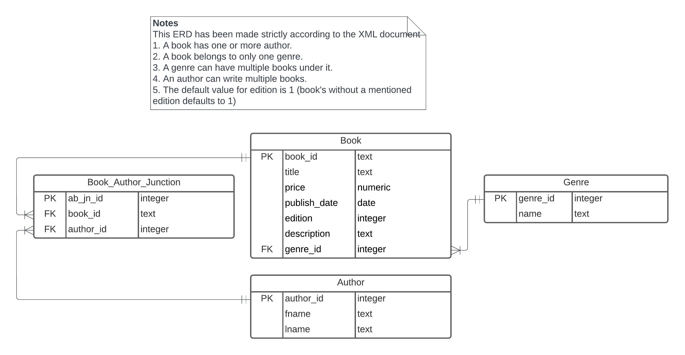

Loading required libraries
```{r importingLibraries, }
library(XML)
library(knitr)
library(RSQLite)
```


## Question 1
Rendering the image of my ER Diagram
```{r renderingImage}

```


## Question 2
Connecting to the database
```{r connectingToDatabase, }
cwd <- getwd()
dbFile <- "book.db"
pathToDb <- paste0(cwd,  .Platform$file.sep, dbFile)
conn <-
  dbConnect(RSQLite::SQLite(), pathToDb)

```

Dropping tables before re-creating them

```{sql droppingGenre, connection=conn}
DROP TABLE IF EXISTS genre;
```

```{sql droppingAuthor, connection=conn}
DROP TABLE IF EXISTS author;
```

```{sql droppingBook, connection=conn}
DROP TABLE IF EXISTS book;
```

```{sql droppingBookAuthorJunction, connection=conn}
DROP TABLE IF EXISTS book_author_junction;
```

Creating table Genre
```{sql creatingTableGenre, connection=conn}
CREATE TABLE genre(
genre_id INTEGER PRIMARY KEY,
name TEXT NOT NULL
);
```

Creating table Author
```{sql creatingTableAuthor, connection=conn}
CREATE TABLE author(
author_id INTEGER PRIMARY KEY,
fname TEXT NOT NULL,
lname TEXT NOT NULL
);
```

Creating table Book
```{sql creatingTableBook, connection=conn}
CREATE TABLE book(
book_id TEXT PRIMARY KEY,
title TEXT NOT NULL,
price REAL NOT NULL,
publish_date DATE NOT NULL,
edition INTEGER DEFAULT 1,
description TEXT NOT NULL,
genre_id INTEGER NOT NULL,
CONSTRAINT fk_visit_genre_id FOREIGN KEY (genre_id) 
REFERENCES genre(genre_id) 
ON DELETE CASCADE 
ON UPDATE CASCADE
);
```

Creating table Book_Author_Junction
```{sql creatingBookAuthorJunction, connection=conn}
CREATE TABLE book_author_junction(
ab_jn_id INTEGER PRIMARY KEY,
book_id INTEGER NOT NULL,
author_id INTEGER NOT NULL,
CONSTRAINT fk_visit_book_id FOREIGN KEY (book_id) 
REFERENCES book(book_id) 
ON DELETE CASCADE 
ON UPDATE CASCADE,
CONSTRAINT fk_visit_author_id FOREIGN KEY (author_id) 
REFERENCES author(author_id) 
ON DELETE CASCADE 
ON UPDATE CASCADE
);
```


## Question 3
```{r loadingXMLData, }
# Reading the XML file
xmlFile <- "Books-v4.xml"
pathToFile <- paste0(cwd, .Platform$file.sep, xmlFile)
parsedXML <- xmlParse(pathToFile, trim = T)
root <- xmlRoot(parsedXML)
sizeOfXML <- xmlSize(root)

# --- Author
# Processing authors
# The idea was to add all the authors into a vector, as a book may have multiple authors
# I then find the distinct values in this vector and then split their name into first
# and last name
firstNames <- c()
lastNames <- c()
authorXPath <- "//author"
author <- xpathSApply(root, authorXPath, xmlValue)
nauthor <- length(author)

for (i in 1:nauthor) {
   splitAuthorName <- strsplit(author[i], ', ')
   firstNames <- c(firstNames, splitAuthorName[[1]][[2]])
   lastNames <- c(lastNames, splitAuthorName[[1]][[1]])
}

firstNames <- unique(firstNames)
lastNames <- unique(lastNames)
noOfUniqueAuthors <- length(firstNames)

authorDf <- data.frame (author_id =  integer(noOfUniqueAuthors),
                         fname = character(noOfUniqueAuthors),
                         lname = character(noOfUniqueAuthors),
                         stringsAsFactors = F)

authorDf$author_id <- 1:noOfUniqueAuthors
authorDf$fname = firstNames
authorDf$lname = lastNames
# --- Author


# --- Genre
# The idea with genre was the same as authors, push all genres into a vector and then remove duplicates
genre = c()
authorXPath <- "//genre"
genres <- xpathSApply(root, authorXPath, xmlValue)
ngenres <- length(genres)

for (i in 1:ngenres) {
   genre <- c(genre, genres[i])
}

genre <- unique(genre)
noOfUniqueGenres <- length(genre)

genreDf <- data.frame (genre_id =  integer(noOfUniqueGenres),
                         name = character(noOfUniqueGenres),
                         stringsAsFactors = F)

genreDf$genre_id <- 1:noOfUniqueGenres
genreDf$name = genre
# --- Genre

# --- Book
# To book dataframe is populated by a mix of xPath expressions and R
# The idea was to extract the book_id for every book
# then target a book by its book_id and then extract every other elemet from it
# the elements being publish_date, author, edition, price, etc
bookDf <- data.frame (book_id =  integer(sizeOfXML),
                         title = character(sizeOfXML),
                      price = double(sizeOfXML),
                      publish_date = character(sizeOfXML),
                      edition = integer(sizeOfXML),
                      description = character(sizeOfXML),
                      genre_id = integer(sizeOfXML),
                         stringsAsFactors = F)


bookIds = c()
authorIds = c()
populateAuthors <- function(bookId, authors, bookIds, authorIds) {
  nAuthors = length(authors)
  for (i in 1:nAuthors) {
    bookIds <- c(bookIds, bookId)
    splitAuthorName <- strsplit(authors[i], ", ")[[1]]
    locatedAuthor <- which(authorDf$fname == splitAuthorName[2] 
                           & authorDf$lname == splitAuthorName[1])
    authorIds <- c(authorIds, locatedAuthor)
  }
  
  return(list(bookIds = bookIds, authorIds = authorIds))
}

for (i in 1:sizeOfXML) {
  bid <- xmlAttrs(root[[i]])
  commonXpath = sprintf("/catalog/book[@id='%s']/", bid)
  bookDf$book_id[i] <- bid
  
  authorXPath <- paste0(commonXpath, 'author')
  authors <- xpathSApply(root[[i]], authorXPath, xmlValue)
  result <- populateAuthors(bid, authors, bookIds, authorIds)
  bookIds <- result$bookIds
  authorIds <- result$authorIds
  
  titleXPath = paste0(commonXpath, 'title')
  title = xpathSApply(root[[i]], titleXPath, xmlValue)
  bookDf$title[i] <- title
  
  genreXpath = paste0(commonXpath, 'genre')
  genre = xpathSApply(root[[i]], genreXpath, xmlValue)
  bookDf$genre_id[i] <- which(genreDf$name == genre)
  

  priceXPath = paste0(commonXpath, 'price')
  price = xpathSApply(root[[i]], priceXPath, xmlValue)
  bookDf$price[i] <- as.double(price)
  
  pDateXPath = paste0(commonXpath, 'publish_date')
  pDate = xpathSApply(root[[i]], pDateXPath, xmlValue)
  bookDf$publish_date[i] <- pDate
  
  editionXPath = paste0(commonXpath, 'edition')
  edition = xpathSApply(root[[i]], editionXPath, xmlValue)
  if (length(edition) > 0) {
    bookDf$edition[i] <- edition
  } else {
     bookDf$edition[i] <- 1
  }
  
  descriptionXPath = paste0(commonXpath, 'description')
  description = xpathSApply(root[[i]], descriptionXPath, xmlValue)
  bookDf$description[i] <- description
}
nAuthorIds <- length(authorIds)
# --- Book

# --- Book_Author_Junction
# Here I map book_id to author_id
bookAuthorJnDf <- data.frame (ab_jn_id =  integer(nAuthorIds),
                         book_id = integer(nAuthorIds),
                      author_id = integer(nAuthorIds),
                         stringsAsFactors = F)
bookAuthorJnDf$book_id <- bookIds
bookAuthorJnDf$author_id <- authorIds
bookAuthorJnDf$ab_jn_id <- 1:nAuthorIds
# --- Book_Author_Junction
```
## Question 4
Using dbWriteTable to write all the dataframes to the tables
```{r insertingValuesIntoTables, }
dbWriteTable(conn, "author", authorDf, append = T, row.names = F)
dbWriteTable(conn, "genre", genreDf, append = T, row.names = F)
dbWriteTable(conn, "book", bookDf, append = T, row.names = F)
dbWriteTable(conn, "book_author_junction", bookAuthorJnDf, append = T, row.names = F)
```

## Question 5.A
```{sql q5a, connection=conn}
SELECT COUNT(*) AS no_of_genres
FROM (
    SELECT COUNT(*)
    FROM genre g
    JOIN book b ON b.genre_id = g.genre_id
    GROUP BY g.genre_id
    HAVING COUNT(*) >= 3
);
```

## Question 5.B
```{sql q5b, connection=conn}
SELECT strftime('%Y', MIN(publish_date)) AS oldest_year 
FROM book;
```


## Question 5.C
```{sql q5c, connection=conn}
SELECT g.name, COUNT(g.genre_id) as no_of_books, AVG(b.price) as avg_price
FROM genre g
JOIN book b on b.genre_id = g.genre_id
GROUP BY g.genre_id;
```

## Question 5.D
```{sql q5d, connection=conn}
SELECT b.title, COUNT(bajn.author_id)
FROM book_author_junction bajn
JOIN book b ON b.book_id = bajn.book_id
GROUP BY bajn.book_id
HAVING COUNT(bajn.author_id) > 1;
```
## Question 5.E
```{sql q5e, connection=conn}
SELECT b.title, a.fname || ' ' || a.lname AS author
FROM book b
JOIN book_author_junction bajn ON b.book_id = bajn.book_id
JOIN author a ON bajn.author_id = a.author_id
WHERE b.price < 0.8 * (SELECT AVG(price) FROM book)
   OR b.price > 1.2 * (SELECT AVG(price) FROM book);
```

## Disconnect from database
```{r disconnectDB, }
dbDisconnect(conn)
```

